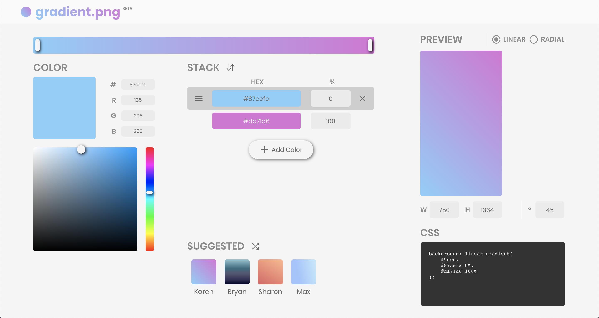

# gradient.png

[gradient.png](https://gradient-png.netlify.app/) is a custom image generation web app.

Customizable features:

-   2 - 5 colors and their respective percentages
-   Image height and width (in pixels)
-   Linear or radial gradient
-   Linear gradient degrees or radial gradient center

Download the image (for wallpapers) or copy the CSS (for divs)!

## Installation

1. Clone this repo
2. `npm install`
3. `npm start`

## Motivation

Many background customization features require uploading an image -- social media profile covers/banners, Gmail theme, your phone/laptop wallpaper. Gradients are a great option for such instances. They're pretty, yet subdued and not distracting.

[CSS Gradient](https://cssgradient.io/) exists as a customizable gradient background generator for websites. Specifically, they generate the CSS that can be supplied for a div's `background` property. However, this site does not have the option to export the generated gradient as an image. I decided to take this opportunity as a UI/UX redesign challenge, in addition to adding the image exportation feature.

The goal was to hone in my React skills, getting into the habit of good web dev practices, as well as generate an intuitive and responsive user interface and experience.

## Dependencies

gradient.png uses the following npm packages:

-   [Create React App](https://reactjs.org/docs/create-a-new-react-app.html): Boilerplate for the app
-   [Material-UI](https://material-ui.com/): Sliders, Transitions, button ripple effect, Radio Group
-   [React-Draggable](https://www.npmjs.com/package/react-draggable): Saturation/Value draggable picker
-   [React Icons](https://react-icons.github.io/react-icons/#/): All the icons

## Acknowledgments

-   [Dora Zhao](https://github.com/dorazhao99) for the [initial mockup](https://www.figma.com/file/qrHzRqGyHRe3RMRSftpy73/Gradient-Picker?node-id=0%3A1)
-   [CSS Gradient](https://cssgradient.io/) for the redesign inspiration
-   [Michael Jackson](https://gist.github.com/mjackson) for [color space conversion algorithms](https://gist.github.com/mjackson/5311256)
